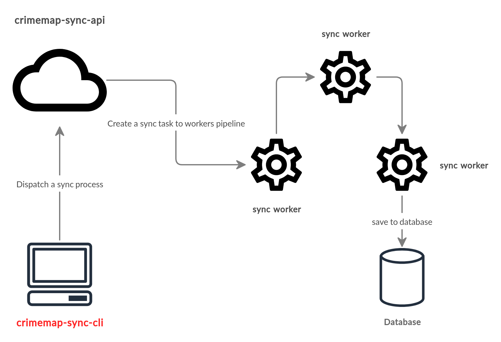

# crime-sync-cli &middot; [](https://github.com/paulosales/crimemap-sync-cli/blob/master/LICENSE) [](https://www.npmjs.com/package/crimemap-sync-cli) [](https://travis-ci.com/paulosales/crimemap-sync-cli) [](https://codecov.io/gh/paulosales/crimemap-sync-cli)

**crime-sync-cli** is CLI tool that provides useful commands to import crimes data to crimemap database.
It is a interface to **[crimemap-sync-api](https://github.com/paulosales/crimemap-sync-api)** server that you can use to dispatch data syncronization workers on its api server.

## Overview diagram

The diagram below gives a ideia of how the syncronization process works.



## Installation

Install **crime-sync-cli** with

```bash
$ npm i --global crimemap-sync-cli
```

And type the following line to test the installation

```bash
$ crime-sync --version
```

Since the **crimemap-sync-cli** is just a interface to syncronization server, you need to install the [sync server](https://github.com/paulosales/crimemap-sync-api) as well. Follow the [these instructions](https://github.com/paulosales/crimemap-sync-api#installation) to get sync server installed.

## Usage

```text
Usage: crime-sync [command]

A syncronizer client tool to import crime data to crimemap database.

Options:
  -V, --version                output the version number
  -h, --help                   output usage information

Commands:
  login <username> <password>  Log-in into crimemap database.
  logout                       Log-out from crimemap database.
  import <pdf-url>             Import crimes data from pdf file crimemap database.
  list-imports [options]       List the top 10 most recents data imports.
  remove-import <ID>           Remove a crime data import.

Examples:
  $ crime-sync import http://domain.com/files/crimesdata-2019-02-05.pdf
```

## Tech stack

- [Commander](https://github.com/tj/commander.js/)
- [Apollo-Client](https://github.com/apollographql/apollo-client)
- [MochaJs](https://mochajs.org/)

## License

[MIT](https://github.com/paulosales/crimemap-sync-cli/blob/master/LICENSE) © [paulosales](https://github.com/paulosales/)
