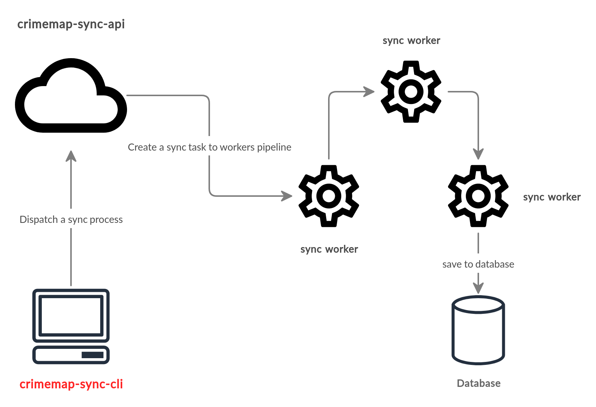

# crime-sync-cli &middot; [](https://github.com/paulosales/crimemap-sync-cli/blob/master/LICENSE) [](https://www.npmjs.com/package/crimemap-sync-cli) [](https://travis-ci.com/paulosales/crimemap-sync-cli) [](https://codecov.io/gh/paulosales/crimemap-sync-cli) [](https://www.codefactor.io/repository/github/paulosales/crimemap-sync-cli) [](https://sonarcloud.io/dashboard?id=paulosales_crimemap-sync-cli)

**crime-sync-cli** is CLI tool that provides useful commands to import crime data to the crime map database.
It is an interface to **[crimemap-sync-api](https://github.com/paulosales/crimemap-sync-api)** server that you can use to dispatch commands to the data synchronization server.
The commands that you can use are:

- **login** - get the access token from API server
- **logout** - remove the current access token from your computer.
- **import** - import a pdf file to the crime map database.
- **list-imports** - list top N imports from the crime map database.
- **remove-import** - remove import headers and all data imported from the crime map database.

## Table of contents

- [1. Overview diagram](#overview-diagram)
- [2. Installation](#installation)
- [3. Usage](#usage)
- [4. Tech stack](#tech-stack)
- [5. License](#license)

## Overview diagram

The diagram below shows how data extracted from a PDF file is imported to the crime map database.



## Installation

Install **crime-sync-cli** with

```bash
$ npm i --global crimemap-sync-cli
```

And type the following line to test the installation

```bash
$ crime-sync --version
version 0.1.9
```

Since the **crimemap-sync-cli** is just an interface to a synchronization server, you need to install the [sync server](https://github.com/paulosales/crimemap-sync-api) as well. Follow [these instructions](https://github.com/paulosales/crimemap-sync-api#installation) to get the sync server installed.

## Usage

Here we have an animated usage sample that helps you to understand fast what is the **crimemap-sync-cli**.


And here we have the help text of the CLI tool:

```text
Usage: crime-sync [command]

A syncronizer client tool to import crime data to crimemap database.

Options:
  -V, --version                output the version number
  -h, --help                   output usage information

Commands:
  login <username> <password>  Log-in into crimemap database.
  logout                       Log-out from crimemap database.
  import <pdf-url>             Import crimes data from pdf file crimemap database.
  list-imports [options]       List the top 10 most recents data imports.
  remove-import <ID>           Remove a crime data import.

Examples:
  $ crime-sync import http://domain.com/files/crimesdata-2019-02-05.pdf
```

## Tech stack

- [Commander](https://github.com/tj/commander.js/)
- [Apollo-Client](https://github.com/apollographql/apollo-client)
- [MochaJs](https://mochajs.org/)

## License

[MIT](https://github.com/paulosales/crimemap-sync-cli/blob/master/LICENSE) © [paulosales](https://github.com/paulosales/)
